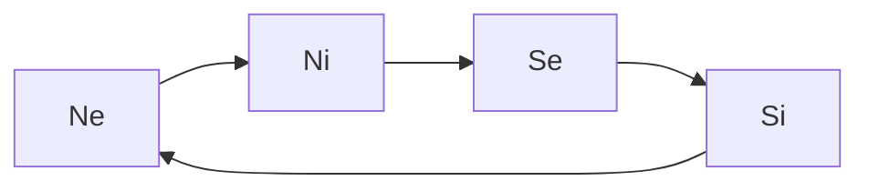
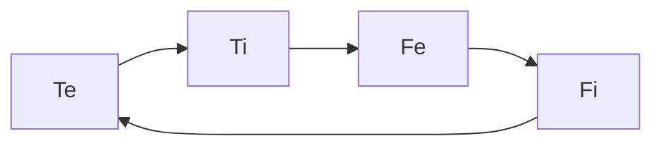

---
{"dg-publish":true,"permalink":"/cards/depth-psychology-theory/cognitive-functions/","created":"2022-12-27T19:17:15.571+01:00","updated":"2023-05-02T20:46:34.179+02:00"}
---

The 8 Cognitive Functions are 8 different ways of interacting with the world. 
Everyone uses all 8 functions, but in different orders of preference, that are tied to [[CARDS/Depth Psychology Theory/Attitude🎭\|attitudes]]. 

# 8 cognitive Functions 
- 4 functions for gathering information ([[SOURCES/Type Theory by CSJ/Mechanics/Perception\|Perception]])
	- [[CARDS/Depth Psychology Theory/Foundational/Ne\|Ne]] ([[CARDS/Depth Psychology Theory/Foundational/Ne\|Extroverted Intuition]]) : Possibilities
	- [[CARDS/Depth Psychology Theory/Foundational/Ni\|Ni]] ([[CARDS/Depth Psychology Theory/Foundational/Ni\|Introverted Intuition]]) : Desire
	- [[CARDS/Depth Psychology Theory/Foundational/Se\|Se]] ([[CARDS/Depth Psychology Theory/Foundational/Se\|Extroverted Sensation]]) : Physics 
	- [[CARDS/Depth Psychology Theory/Foundational/Si\|Si]] : ([[CARDS/Depth Psychology Theory/Foundational/Si\|Introverted Sensation]]) : Experience
[[CARDS/Depth Psychology Theory/Wheel of Perception\|Wheel of Perception]] :

- 4 functions for making decisions ([[CARDS/Depth Psychology Theory/Judgement\|Judgement]])
	- [[CARDS/Depth Psychology Theory/Foundational/Te\|Te]] ([[CARDS/Depth Psychology Theory/Foundational/Te\|Extroverted Thinking]]) : [[CARDS/· Related Concepts & Theories ·/Belief\|Belief]] 
	- [[CARDS/Depth Psychology Theory/Foundational/Ti\|Ti]] ([[CARDS/Depth Psychology Theory/Foundational/Ti\|Introverted Thinking]]) : Deduction 
	- [[CARDS/Depth Psychology Theory/Foundational/Fe\|Fe]] [[CARDS/Depth Psychology Theory/Foundational/Fe\|(Extroverted Feeling]]) : Ethics
	- [[CARDS/Depth Psychology Theory/Foundational/Fi\|Fi]] [[CARDS/Depth Psychology Theory/Foundational/Fi\|(Introverted Feeling]]) : Morals 
[[CARDS/Depth Psychology Theory/Wheel of Judgement\|Wheel of Judgement]] :

---
# Hierarchy 
Like with our hands, some functions are prefered over others, such that we are more at ease with using them.  
> Example : some prefer to judge wether something is true or false, while others prefer to judge whether something is right or wrong. 

These preferences exclude each other ([[CARDS/Depth Psychology Theory/Reflection 🪞\|Reflection 🪞]]): 
- [[CARDS/Depth Psychology Theory/Foundational/Ti\|Ti]] (*Deduce*) excludes [[CARDS/Depth Psychology Theory/Foundational/Fi\|Fi]] (*Weigh*) : to judge wether sth is true / false ([[CARDS/Depth Psychology Theory/Foundational/Ti\|Ti]]) one must restrain oneself to judge whether it is good / bad ([[CARDS/Depth Psychology Theory/Foundational/Fi\|Fi]])
- [[CARDS/Depth Psychology Theory/Foundational/Si\|Si]] (*Sense*) excludes [[CARDS/Depth Psychology Theory/Foundational/Ni\|Ni]] (*Imagine*) 
- [[CARDS/Depth Psychology Theory/Foundational/Se\|Se]] (*React*) excludes [[CARDS/Depth Psychology Theory/Foundational/Ne\|Ne]] (*Predict*)
- [[CARDS/Depth Psychology Theory/Foundational/Te\|Te]] (*Believe*) excludes [[CARDS/Depth Psychology Theory/Foundational/Fe\|Fe]] (*Empathize*) 
