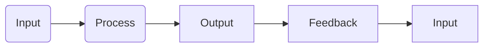
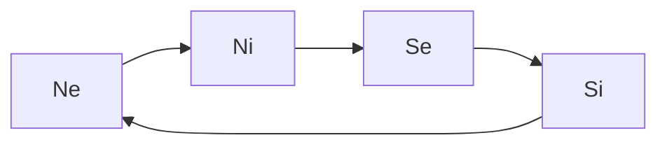
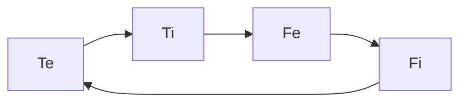

---
{"dg-publish":true,"permalink":"/cards/depth-psychology-theory/cognitive-functions/","created":"2022-12-27T19:17:15.571+01:00","updated":"2023-04-27T15:24:03.022+02:00"}
---

Cognitive Functions are mental tools to be used and improved to deal with life and other humans. 
Like with our hands, some functions are prefered over others, such that we are more at ease with some functions than others. 

Example : some prefer to judge wether something is true or false, while others prefer to judge whether something is right or wrong. 
These preferences exclude each other : 
- [[CARDS/Depth Psychology Theory/Foundational/Ti🗡️\|Ti🗡️]] (*Deduce*) excludes [[CARDS/Depth Psychology Theory/Foundational/Fi🧭\|Fi🧭]] (*Weigh*) : to judge wether sth is true / false ([[CARDS/Depth Psychology Theory/Foundational/Ti🗡️\|Ti🗡️]]) one must retrain itself to judge whether it is good / bad ([[CARDS/Depth Psychology Theory/Foundational/Fi🧭\|Fi🧭]])
- [[CARDS/Depth Psychology Theory/Foundational/Si\|Si]] (*Sense*) excludes [[CARDS/Depth Psychology Theory/Foundational/Ni🔥\|Ni🔥]] (*Imagine*) 
- [[CARDS/Depth Psychology Theory/Foundational/Se🌪️\|Se🌪️]] (*React*) excludes [[CARDS/Depth Psychology Theory/Foundational/Ne\|Ne]] (*Predict*)
- [[CARDS/Depth Psychology Theory/Foundational/Te\|Te]] (*Believe*) excludes [[CARDS/Depth Psychology Theory/Foundational/Fe💉\|Fe💉]] (*Empathize*) 

## IPOF

[[CARDS/Depth Psychology Theory/Input 🌊\|Input 🌊]] : 
	[[CARDS/Depth Psychology Theory/Foundational/Ne\|Ne]] : possibilities
	[[CARDS/Depth Psychology Theory/Foundational/Te\|Te]] : beliefs 
[[Process\|Process]] : 
	[[CARDS/Depth Psychology Theory/Foundational/Ni🔥\|Ni🔥]] : desire
	[[CARDS/Depth Psychology Theory/Foundational/Ti🗡️\|Ti🗡️]] : deduction
[[Output\|Output]] : 
	[[CARDS/Depth Psychology Theory/Foundational/Se🌪️\|Se🌪️]] : performance
	[[CARDS/Depth Psychology Theory/Foundational/Fe💉\|Fe💉]] : ethics
[[Feedback\|Feedback]] : 
	[[CARDS/Depth Psychology Theory/Foundational/Si\|Si]] : needs
	[[CARDS/Depth Psychology Theory/Foundational/Fi🧭\|Fi🧭]] : morals

## Perception

[[CARDS/Depth Psychology Theory/Foundational/Ne\|Ne]] : [[CARDS/Depth Psychology Theory/Foundational/Ne\|Extroverted Intuition]]
[[CARDS/Depth Psychology Theory/Foundational/Ni🔥\|Ni🔥]] : [[CARDS/Depth Psychology Theory/Foundational/Ni🔥\|Introverted Intuition]]
[[CARDS/Depth Psychology Theory/Foundational/Se🌪️\|Se🌪️]] : [[CARDS/Depth Psychology Theory/Foundational/Se🌪️\|Extroverted Sensation]]
[[CARDS/Depth Psychology Theory/Foundational/Si\|Si]] : [[CARDS/Depth Psychology Theory/Foundational/Si\|Introverted Sensation]]

## Judgement

[[CARDS/Depth Psychology Theory/Foundational/Te\|Te]] : [[CARDS/Depth Psychology Theory/Foundational/Te\|Extroverted Thinking]] 
[[CARDS/Depth Psychology Theory/Foundational/Ti🗡️\|Ti🗡️]] : [[CARDS/Depth Psychology Theory/Foundational/Ti🗡️\|Introverted Thinking]]
[[CARDS/Depth Psychology Theory/Foundational/Fe💉\|Fe💉]] : [[CARDS/Depth Psychology Theory/Foundational/Fe💉\|Extroverted Feeling]]
[[CARDS/Depth Psychology Theory/Foundational/Fi🧭\|Fi🧭]] : [[CARDS/Depth Psychology Theory/Foundational/Fi🧭\|Introverted Feeling]]

