```mermaid

graph LR; 

A("Ne💧") --> B("Ni🔥") --> C("Se🌪️") --> D("Si⛰️") --> A("Ne💧")

```

```mermaid

graph LR; 

A("Te🏹") --> B("Ti🗡️") --> C("Fe💉") --> D("Fi🧭") --> A("Te🏹") 

```

---
{"dg-publish":true,"permalink":"/cards/depth-psychology-theory/cognitive-functions/","noteIcon":"1","created":"2022-12-27T19:17:15.571+01:00","updated":"2023-06-22T21:01:18.296+02:00"}
---

- The 8 Cognitive Functions are 8 different ways of interacting with the world. 
- Everyone uses all 8 functions equally. 
- But we are not equally **aware** of all functions. Each [[EXTRAS/Templates/Type\|Type]] prefers to tune in some functions more than others. We tune in our [[CARDS/Depth Psychology Theory/Hero🦸‍♂️\|Dominant]] function with the highest [[FPS\|FPS]], then the [[CARDS/Depth Psychology Theory/Parent🤨\|Secund]] etc all the way down to the [[CARDS/Depth Psychology Theory/Demon😈\|Eighth]] function. 
- Each of the 8 ranks is tied to an [[CARDS/Depth Psychology Theory/Attitude🎭\|Attitude🎭]].  
- Our order of preference changes dynamically, depending on the [[CARDS/Depth Psychology Theory/4 sides of the Mind➕\|side of the mind]] we are in. 

# 8 cognitive Functions 
- 4 functions for gathering information ([[Perception\|Perception]])
	- [[CARDS/Depth Psychology Theory/Foundational/Ne\|Ne💧]] ([[CARDS/Depth Psychology Theory/Foundational/Ne\|Extroverted Intuition]]) : Possibilities
	- [[CARDS/Depth Psychology Theory/Foundational/Ni\|Ni🔥]] ([[CARDS/Depth Psychology Theory/Foundational/Ni\|Introverted Intuition]]) : Choice
	- [[CARDS/Depth Psychology Theory/Foundational/Se\|Se🌪️]] ([[CARDS/Depth Psychology Theory/Foundational/Se\|Extroverted Sensation]]) : Performance 
	- [[CARDS/Depth Psychology Theory/Foundational/Si\|Si⛰️]] : ([[CARDS/Depth Psychology Theory/Foundational/Si\|Introverted Sensation]]) : Experience

<a class="markdown-embed-link" href="/cards/depth-psychology-theory/wheel-of-perception/#bf4fe6" aria-label="Open link"><svg xmlns="http://www.w3.org/2000/svg" width="24" height="24" viewBox="0 0 24 24" fill="none" stroke="currentColor" stroke-width="2" stroke-linecap="round" stroke-linejoin="round" class="svg-icon lucide-link"><path d="M10 13a5 5 0 0 0 7.54.54l3-3a5 5 0 0 0-7.07-7.07l-1.72 1.71"></path><path d="M14 11a5 5 0 0 0-7.54-.54l-3 3a5 5 0 0 0 7.07 7.07l1.71-1.71"></path></svg></a>

<a class="markdown-embed-link" href="/cards/depth-psychology-theory/wheel-of-perception/#bdab20" aria-label="Open link"><svg xmlns="http://www.w3.org/2000/svg" width="24" height="24" viewBox="0 0 24 24" fill="none" stroke="currentColor" stroke-width="2" stroke-linecap="round" stroke-linejoin="round" class="svg-icon lucide-link"><path d="M10 13a5 5 0 0 0 7.54.54l3-3a5 5 0 0 0-7.07-7.07l-1.72 1.71"></path><path d="M14 11a5 5 0 0 0-7.54-.54l-3 3a5 5 0 0 0 7.07 7.07l1.71-1.71"></path></svg></a>

 

---
- 4 functions for making decisions ([[CARDS/Depth Psychology Theory/Judgement\|Judgement]])
	- [[CARDS/Depth Psychology Theory/Foundational/Te\|Te🏹]] ([[CARDS/Depth Psychology Theory/Foundational/Te\|Extroverted Thinking]]) 
	- [[CARDS/Depth Psychology Theory/Foundational/Ti\|Ti🗡️]] ([[CARDS/Depth Psychology Theory/Foundational/Ti\|Introverted Thinking]]) 
	- [[CARDS/Depth Psychology Theory/Foundational/Fe\|Fe💉]] [[CARDS/Depth Psychology Theory/Foundational/Fe\|(Extroverted Feeling]])
	- [[CARDS/Depth Psychology Theory/Foundational/Fi\|Fi🧭]] [[CARDS/Depth Psychology Theory/Foundational/Fi\|(Introverted Feeling]])

<a class="markdown-embed-link" href="/cards/depth-psychology-theory/wheel-of-judgement/#e501ef" aria-label="Open link"><svg xmlns="http://www.w3.org/2000/svg" width="24" height="24" viewBox="0 0 24 24" fill="none" stroke="currentColor" stroke-width="2" stroke-linecap="round" stroke-linejoin="round" class="svg-icon lucide-link"><path d="M10 13a5 5 0 0 0 7.54.54l3-3a5 5 0 0 0-7.07-7.07l-1.72 1.71"></path><path d="M14 11a5 5 0 0 0-7.54-.54l-3 3a5 5 0 0 0 7.07 7.07l1.71-1.71"></path></svg></a>

<a class="markdown-embed-link" href="/cards/depth-psychology-theory/wheel-of-judgement/#b929e0" aria-label="Open link"><svg xmlns="http://www.w3.org/2000/svg" width="24" height="24" viewBox="0 0 24 24" fill="none" stroke="currentColor" stroke-width="2" stroke-linecap="round" stroke-linejoin="round" class="svg-icon lucide-link"><path d="M10 13a5 5 0 0 0 7.54.54l3-3a5 5 0 0 0-7.07-7.07l-1.72 1.71"></path><path d="M14 11a5 5 0 0 0-7.54-.54l-3 3a5 5 0 0 0 7.07 7.07l1.71-1.71"></path></svg></a>

---
# Hierarchy 
Like with our hands, some functions are prefered over others, such that we are more at ease with using them.  
> Example : some prefer to judge wether something is true or false, while others prefer to judge whether something is right or wrong. 

These preferences exclude each other ([[CARDS/Depth Psychology Theory/Reflection 🪞\|Reflection 🪞]]): 
- [[CARDS/Depth Psychology Theory/Foundational/Ti\|Ti]] (*Deduce*) excludes [[CARDS/Depth Psychology Theory/Foundational/Fi\|CARDS/Depth Psychology Theory/Foundational/Fi]] (*Weigh*) : to judge wether sth is true / false ([[CARDS/Depth Psychology Theory/Foundational/Ti\|Ti]]) one must restrain oneself to judge whether it is good / bad ([[CARDS/Depth Psychology Theory/Foundational/Fi\|CARDS/Depth Psychology Theory/Foundational/Fi]])
- [[CARDS/Depth Psychology Theory/Foundational/Si\|Si]] (*Sense*) excludes [[CARDS/Depth Psychology Theory/Foundational/Ni\|Ni]] (*Imagine*) 
- [[CARDS/Depth Psychology Theory/Foundational/Se\|Se]] (*React*) excludes [[CARDS/Depth Psychology Theory/Foundational/Ne\|Ne]] (*Predict*)
- [[CARDS/Depth Psychology Theory/Foundational/Te\|Te]] (*Believe*) excludes [[CARDS/Depth Psychology Theory/Foundational/Fe\|Fe]] (*Empathize*) 
