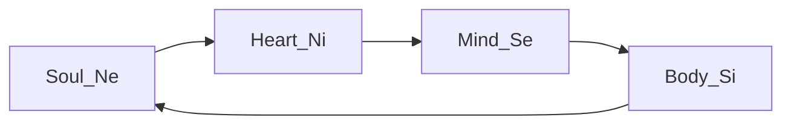
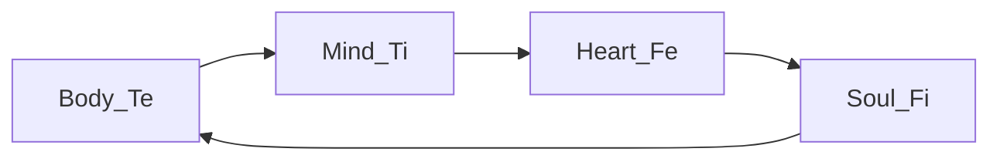

---
{"dg-publish":true,"permalink":"/cards/depth-psychology-theory/temple/","created":"2023-01-06T12:36:08.723+01:00","updated":"2023-04-27T07:55:16.055+02:00"}
---

# Temples of Humanity’s Mind
| [[CARDS/Depth Psychology Theory/Soul Temple 👥\|Soul Temple 👥]]  | [[CARDS/Depth Psychology Theory/Mind Temple ⚒️\|Mind Temple ⚒️]] |
| ------------------- | ------------------ |
| [[CARDS/Depth Psychology Theory/Heart Temple 🎭\|Heart Temple 🎭]] | [[CARDS/Depth Psychology Theory/Body Temple 🌳\|Body Temple 🌳]]                    |

## Wheel of Perception 

## Wheel of Judgement

## IPOF
> Functions operate in an input-process-output-feedback order : 
> Ne input --> Ni process --> Se output --> Si feedback
> Te input --> Ti process --> Fe output --> Fi feedback