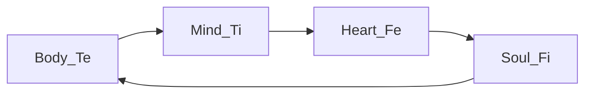

---
{"dg-publish":true,"permalink":"/cards/depth-psychology-theory/temple/","noteIcon":"1","created":"2023-01-06T12:36:08.723+01:00","updated":"2023-06-14T10:15:09.031+02:00"}
---

A temple is comprised of 4 types (constituting [[CARDS/Depth Psychology Theory/4 sides of the Mind➕\|4 sides of the Mind➕]]) worshiping a particular philosophy of life. 

- [4:55](https://www.youtube.com/watch?v=mB0tLRRTrao&t=295s) "The temples are the 4 components of human experience." `=this.Shortref` 

- The [[CARDS/Depth Psychology Theory/Ego🙋‍♂️\|Ego🙋‍♂️]]/ [[CARDS/Depth Psychology Theory/Superego👹\|Superego👹]] temples are competing for control `=this.Shortref` 

# of Humanity{ #3d2752}

| [[CARDS/Depth Psychology Theory/Soul Temple👤\|Soul Temple👤]]  | [[CARDS/Depth Psychology Theory/Mind Temple🛠️\|Mind Temple🛠️]] influence|
| ------------------- | ------------------ |
| [[CARDS/Depth Psychology Theory/Heart Temple🎭\|Heart Temple🎭]] influence | [[CARDS/Depth Psychology Theory/Body Temple 🌳\|Body Temple 🌳]] influence                    |

---
# of an Individual

## Soul
| [[CARDS/Depth Psychology Theory/Ego🙋‍♂️\|Ego🙋‍♂️]] / [[CARDS/Depth Psychology Theory/Shadow👥\|Shadow👥]]  | [[CARDS/Depth Psychology Theory/Sub🤸\|Sub🤸]] / [[CARDS/Depth Psychology Theory/Superego👹\|Superego👹]]  |
| ------------------ | ------------------ |
|[[CARDS/Depth Psychology Theory/Soul Temple👤\|Soul Temple👤]] | [[CARDS/Depth Psychology Theory/Mind Temple🛠️\|Mind Temple🛠️]] |
|  [[CARDS/Depth Psychology Theory/Heart Temple🎭\|Heart Temple🎭]]|[[CARDS/Depth Psychology Theory/Body Temple 🌳\|Body Temple 🌳]]|

## Heart 
| [[CARDS/Depth Psychology Theory/Ego🙋‍♂️\|Ego🙋‍♂️]] / [[CARDS/Depth Psychology Theory/Shadow👥\|Shadow👥]]  | [[CARDS/Depth Psychology Theory/Sub🤸\|Sub🤸]] / [[CARDS/Depth Psychology Theory/Superego👹\|Superego👹]]  |
| ------------------ | ------------------ |
|[[CARDS/Depth Psychology Theory/Heart Temple🎭\|Heart Temple🎭]] |[[CARDS/Depth Psychology Theory/Body Temple 🌳\|Body Temple 🌳]]  |
|[[CARDS/Depth Psychology Theory/Soul Temple👤\|Soul Temple👤]] |[[CARDS/Depth Psychology Theory/Mind Temple🛠️\|Mind Temple🛠️]]|

## Mind 
| [[CARDS/Depth Psychology Theory/Ego🙋‍♂️\|Ego🙋‍♂️]] / [[CARDS/Depth Psychology Theory/Shadow👥\|Shadow👥]]  | [[CARDS/Depth Psychology Theory/Sub🤸\|Sub🤸]] / [[CARDS/Depth Psychology Theory/Superego👹\|Superego👹]]  |
| ------------------ | ------------------ |
|[[CARDS/Depth Psychology Theory/Mind Temple🛠️\|Mind Temple🛠️]]  |[[CARDS/Depth Psychology Theory/Soul Temple👤\|Soul Temple👤]]   |
|[[CARDS/Depth Psychology Theory/Body Temple 🌳\|Body Temple 🌳]]  |[[CARDS/Depth Psychology Theory/Heart Temple🎭\|Heart Temple🎭]] |

## Body
| [[CARDS/Depth Psychology Theory/Ego🙋‍♂️\|Ego🙋‍♂️]] / [[CARDS/Depth Psychology Theory/Shadow👥\|Shadow👥]]  | [[CARDS/Depth Psychology Theory/Sub🤸\|Sub🤸]] / [[CARDS/Depth Psychology Theory/Superego👹\|Superego👹]]  |
| ------------------ | ------------------ |
|[[CARDS/Depth Psychology Theory/Body Temple 🌳\|Body Temple 🌳]]   |[[CARDS/Depth Psychology Theory/Heart Temple🎭\|Heart Temple🎭]]    |
|[[CARDS/Depth Psychology Theory/Mind Temple🛠️\|Mind Temple🛠️]]   |[[CARDS/Depth Psychology Theory/Soul Temple👤\|Soul Temple👤]]  |

---
# Origin Wheel 
| [[CARDS/Depth Psychology Theory/Ego🙋‍♂️\|Ego🙋‍♂️]]       | [[CARDS/Depth Psychology Theory/Sub🤸\|Subconscious🤸]] |
| ------------------ | ------------------------- |
| [[CARDS/· Related Concepts & Theories ·/Living Virtu🙇\|Living Virtu🙇]] | [[CARDS/Depth Psychology Theory/SD🤸⬅️\|SD🤸⬅️]] Pole           |

| [[CARDS/Depth Psychology Theory/Shadow👥\|Shadow👥]]      | [[CARDS/Depth Psychology Theory/Superego👹\|Superego👹]] |
| ------------------ | ------------------------- |
| [[CARDS/Depth Psychology Theory/UD👥⬅️\|UD👥⬅️]] Pole | [[CARDS/· Related Concepts & Theories ·/Deadly Sins💀\|Deadly Sins💀]]       |

# Wheel of Perception 

# Wheel of Judgement

## IPOF
> Functions operate in an input-process-output-feedback order : 
> Ne input --> Ni process --> Se output --> Si feedback
> Te input --> Ti process --> Fe output --> Fi feedback

# Poles in Temples 
| File                                                                    | temple                                                      | side                                                 | Humanity's Mind                                              | Individual Mind                                             |
| ----------------------------------------------------------------------- | ----------------------------------------------------------- | ---------------------------------------------------- | ------------------------------------------------------------ | ----------------------------------------------------------- |
| [[CARDS/Depth Psychology Theory/Absolution\|Absolution]]             | [[Soul Temple 👥\|Soul👥]]                                  | [[CARDS/Depth Psychology Theory/Ego🙋‍♂️\|🙋‍♂️]] | \-                                                           | \-                                                          |
| [[CARDS/Depth Psychology Theory/Chastity\|Chastity]]                 | \-                                                          | [[CARDS/Depth Psychology Theory/Ego🙋‍♂️\|🙋‍♂️]] | \-                                                           | \-                                                          |
| [[CARDS/Depth Psychology Theory/Compassion\|Compassion]]             | \-                                                          | [[CARDS/Depth Psychology Theory/Ego🙋‍♂️\|🙋‍♂️]] | \-                                                           | \-                                                          |
| [[CARDS/Depth Psychology Theory/Complacency\|Complacency]]           | [[CARDS/Depth Psychology Theory/Body Temple 🌳\|Body🌳]] | [[CARDS/Depth Psychology Theory/Sub🤸\|🤸]]       | [[Mind Temple ⚒️\|Mind⚒️]]                                   | \-                                                          |
| [[CARDS/Depth Psychology Theory/Credulity\|Credulity]]               | \-                                                          | [[CARDS/Depth Psychology Theory/Sub🤸\|🤸]]       | \-                                                           | \-                                                          |
| [[CARDS/· Related Concepts & Theories ·/Desacration\|Desacration]]   | \-                                                          | [[CARDS/Depth Psychology Theory/Shadow👥\|👤]]    | [[CARDS/Depth Psychology Theory/Heart Temple🎭\|Heart🎭]] | [[Soul Temple 👥\|Soul👥]]                                  |
| [[CARDS/Depth Psychology Theory/Egotism\|Egotism]]                   | \-                                                          | [[CARDS/Depth Psychology Theory/Sub🤸\|🤸]]       | \-                                                           | \-                                                          |
| [[CARDS/Depth Psychology Theory/Envy\|Envy]]                         | \-                                                          | [[CARDS/Depth Psychology Theory/Superego👹\|👹]]  | \-                                                           | \-                                                          |
| [[CARDS/Depth Psychology Theory/Fanatism\|Fanatism]]                 | \-                                                          | [[CARDS/Depth Psychology Theory/Sub🤸\|🤸]]       | \-                                                           | \-                                                          |
| [[CARDS/· Related Concepts & Theories ·/Favouritism\|Favouritism]]   | [[Soul Temple 👥\|Soul👥]]                                  | [[CARDS/Depth Psychology Theory/Shadow👥\|👤]]    | \-                                                           | \-                                                          |
| [[CARDS/Depth Psychology Theory/Generativity\|Generativity]]         | [[CARDS/Depth Psychology Theory/Body Temple 🌳\|Body🌳]] | [[CARDS/Depth Psychology Theory/Ego🙋‍♂️\|🙋‍♂️]] | \-                                                           | \-                                                          |
| [[CARDS/Depth Psychology Theory/Generosity\|Generosity]]             | \-                                                          | [[CARDS/Depth Psychology Theory/Ego🙋‍♂️\|🙋‍♂️]] | \-                                                           | \-                                                          |
| [[CARDS/Depth Psychology Theory/Gluttony\|Gluttony]]                 | [[CARDS/Depth Psychology Theory/Body Temple 🌳\|Body🌳]] | [[CARDS/Depth Psychology Theory/Superego👹\|👹]]  | \-                                                           | \-                                                          |
| [[CARDS/Depth Psychology Theory/Greed\|Greed]]                       | \-                                                          | [[CARDS/Depth Psychology Theory/Superego👹\|👹]]  | \-                                                           | \-                                                          |
| [[CARDS/Depth Psychology Theory/Hedonism\|Hedonism]]                 | [[CARDS/Depth Psychology Theory/Body Temple 🌳\|Body🌳]] | [[CARDS/Depth Psychology Theory/Shadow👥\|👤]]    | [[CARDS/Depth Psychology Theory/Heart Temple🎭\|Heart🎭]] | [[Mind Temple ⚒️\|Mind⚒️]]                                  |
| [[CARDS/Depth Psychology Theory/Humility\|Humility]]                 | \-                                                          | [[CARDS/Depth Psychology Theory/Ego🙋‍♂️\|🙋‍♂️]] | \-                                                           | \-                                                          |
| [[CARDS/· Related Concepts & Theories ·/Idolatry\|Idolatry]]         | [[Soul Temple 👥\|Soul👥]]                                  | [[CARDS/Depth Psychology Theory/Shadow👥\|👤]]    | \-                                                           | \-                                                          |
| [[CARDS/· Related Concepts & Theories ·/Impartiality\|Impartiality]] | [[Soul Temple 👥\|Soul👥]]                                  | [[CARDS/Depth Psychology Theory/Sub🤸\|🤸]]       | \-                                                           | \-                                                          |
| [[CARDS/Depth Psychology Theory/Initiative\|Initiative]]             | \-                                                          | [[CARDS/Depth Psychology Theory/Ego🙋‍♂️\|🙋‍♂️]] | \-                                                           | \-                                                          |
| [[CARDS/Depth Psychology Theory/Lust\|Lust]]                         | [[Soul Temple 👥\|Soul👥]]                                  | [[CARDS/Depth Psychology Theory/Superego👹\|👹]]  | \-                                                           | \-                                                          |
| [[CARDS/· Related Concepts & Theories ·/Malevolence\|Malevolence]]   | \-                                                          | [[CARDS/Depth Psychology Theory/Shadow👥\|👤]]    | [[CARDS/Depth Psychology Theory/Heart Temple🎭\|Heart🎭]] | [[Soul Temple 👥\|Soul👥]]                                  |
| [[CARDS/Depth Psychology Theory/Manifestation\|Manifestation]]       | \-                                                          | [[CARDS/Depth Psychology Theory/Shadow👥\|👤]]    | [[CARDS/Depth Psychology Theory/Heart Temple🎭\|Heart🎭]] | [[CARDS/Depth Psychology Theory/Body Temple 🌳\|Body🌳]] |
| [[CARDS/Depth Psychology Theory/Modesty\|Modesty]]                   | \-                                                          | [[CARDS/Depth Psychology Theory/Ego🙋‍♂️\|🙋‍♂️]] | \-                                                           | \-                                                          |
| [[CARDS/Depth Psychology Theory/Objectification\|Objectification]]   | [[Soul Temple 👥\|Soul👥]]                                  | [[CARDS/Depth Psychology Theory/Sub🤸\|🤸]]       | \-                                                           | \-                                                          |
| [[CARDS/· Related Concepts & Theories ·/Obstinance\|Obstinance]]     | \-                                                          | [[CARDS/Depth Psychology Theory/Sub🤸\|🤸]]       | \-                                                           | \-                                                          |
| [[CARDS/Depth Psychology Theory/Servility\|Servility]]               | [[CARDS/Depth Psychology Theory/Body Temple 🌳\|Body🌳]] | [[CARDS/Depth Psychology Theory/Sub🤸\|🤸]]       | [[Mind Temple ⚒️\|Mind⚒️]]                                   | \-                                                          |
| [[CARDS/Depth Psychology Theory/Sloth\|Sloth]]                       | \-                                                          | [[CARDS/Depth Psychology Theory/Superego👹\|👹]]  | \-                                                           | \-                                                          |
| [[CARDS/Depth Psychology Theory/Subjugation\|Subjugation]]           | [[CARDS/Depth Psychology Theory/Body Temple 🌳\|Body🌳]] | [[CARDS/Depth Psychology Theory/Shadow👥\|👤]]    | [[CARDS/Depth Psychology Theory/Heart Temple🎭\|Heart🎭]] | [[Mind Temple ⚒️\|Mind⚒️]]                                  |
| [[CARDS/· Related Concepts & Theories ·/Vainglory\|Vainglory]]       | \-                                                          | [[CARDS/Depth Psychology Theory/Superego👹\|👹]]  | \-                                                           | \-                                                          |
| [[CARDS/· Related Concepts & Theories ·/Wrath\|Wrath]]               | [[Soul Temple 👥\|Soul👥]]                                  | [[CARDS/Depth Psychology Theory/Superego👹\|👹]]  | \-                                                           | \-                                                          |

{ .block-language-dataview}

# Personal Observations 

- Soul NeFi = Philosopher NFP
- Heart NiFe = Templar NFJ 
- Mind SeTi = Templar STP 
- Body SiTe = Philosopher STJ 

