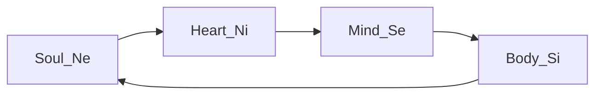
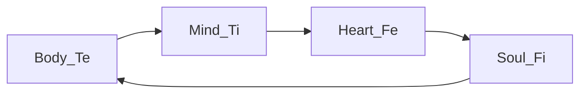

---
{"dg-publish":true,"permalink":"/cards/depth-psychology-theory/temple/","created":"2023-01-06T12:36:08.723+01:00","updated":"2023-05-03T19:40:25.694+02:00"}
---

# Temples of Humanity’s Mind
{ #3d2752}

| [[CARDS/Depth Psychology Theory/Soul Temple 👥\|Soul Temple 👥]]  | [[CARDS/Depth Psychology Theory/Mind Temple ⚒️\|Mind Temple ⚒️]] |
| ------------------- | ------------------ |
| [[CARDS/Depth Psychology Theory/Heart Temple🎭\|Heart Temple🎭]] | [[CARDS/Depth Psychology Theory/Body Temple 🌳\|Body Temple 🌳]]                    |

# Origin Wheel 
| [[CARDS/Depth Psychology Theory/Ego🙋‍♂️\|Ego🙋‍♂️]]       | [[CARDS/Depth Psychology Theory/Sub🤸\|Subconscious🤸]] |
| ------------------ | ------------------------- |
| [[CARDS/· Related Concepts & Theories ·/Living Virtu🙇\|Living Virtu🙇]] | [[CARDS/Depth Psychology Theory/SD🤸⬅️\|SD🤸⬅️]] Pole           |

| [[CARDS/Depth Psychology Theory/Shadow👤\|Shadow👤]]      | [[CARDS/Depth Psychology Theory/Superego👹\|Superego👹]] |
| ------------------ | ------------------------- |
| [[CARDS/Depth Psychology Theory/UD👤⬅️\|UD👤⬅️]] Pole | [[Deadly Sins💀\|Deadly Sins💀]]       |

# Wheel of Perception 

# Wheel of Judgement

## IPOF
> Functions operate in an input-process-output-feedback order : 
> Ne input --> Ni process --> Se output --> Si feedback
> Te input --> Ti process --> Fe output --> Fi feedback