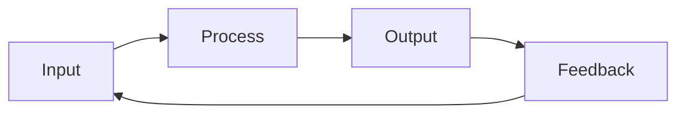
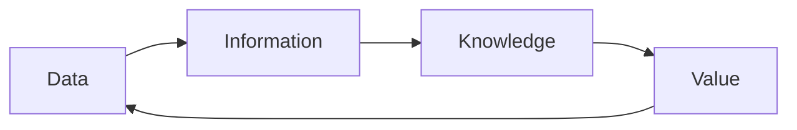
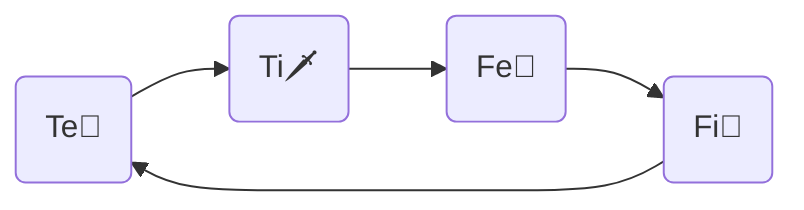

---
{"dg-publish":true,"permalink":"/cards/depth-psychology-theory/wheel-of-judgement/","created":"2023-04-29T21:32:16.290+02:00","updated":"2023-05-12T08:21:17.074+02:00"}
---

#on/depthpsychology 

“A helpful (Fe) belief (Te) is a good (Fi) belief, and a good belief is a true (Ti) belief.” ([[CARDS/Individuals/John Bodine\|John Bodine]] [2021-10-22](https://csjoseph.life/the-brilliance-of-the-trickster/)) 

{ #e501ef}

{ #b929e0}

{ #g0jnk}

[[CARDS/Depth Psychology Theory/Foundational/Te\|Te🏹]] → [[CARDS/Depth Psychology Theory/Foundational/Ti\|Ti🗡️]] → [[CARDS/Depth Psychology Theory/Foundational/Fe\|Fe💉]] → [[CARDS/Depth Psychology Theory/Foundational/Fi\|Fi🧭]] 