---
{"dg-publish":true,"permalink":"/cards/depth-psychology-theory/wheel-of-judgement/","noteIcon":"1","created":"2023-04-29T21:32:16.290+02:00","updated":"2023-05-31T16:14:56.819+02:00"}
---

#on/depthpsychology 

“A helpful (Fe) belief (Te) is a good (Fi) belief, and a good belief is a true (Ti) belief.” ([[CARDS/Individuals/John Bodine\|John Bodine]] [2021-10-22](https://csjoseph.life/the-brilliance-of-the-trickster/)) 

{ #e501ef}

```mermaid

graph LR; 

A("Te🏹") --> B("Ti🗡️") --> C("Fe💉") --> D("Fi🧭") --> A("Te🏹") 

```

{ #b929e0}

{ #g0jnk}

[[CARDS/Depth Psychology Theory/Foundational/Te\|Te🏹]] → [[CARDS/Depth Psychology Theory/Foundational/Ti\|Ti🗡️]] → [[CARDS/Depth Psychology Theory/Foundational/Fe\|Fe💉]] → [[CARDS/Depth Psychology Theory/Foundational/Fi\|Fi🧭]] 

# DEFINITIONS 

- Data is meaningless, without signification nore value on its own
- Information = Data… 
	- put into context 
	- structured 
> [!example]
>  - [[CARDS/Depth Psychology Theory/Data\|Data]] : 30 | apple | box
>  - [[Information\|Information]] : there are 30 apples in the box
- Knowledge = Information…
	- with rules 

# Te-Fi
- [A definition of knowledge - Data and information - GCSE ICT Revision - WJEC - BBC Bitesize](https://www.bbc.co.uk/bitesize/guides/z4g3pg8/revision/5)
- [DIKW pyramid - Wikipedia](https://en.wikipedia.org/wiki/DIKW_pyramid)

> [!quote]- Zeleny
>  [Human systems management : integrating knowledge, management and systems : Zeleny, Milan, 1942- : Free Download, Borrow, and Streaming : Internet Archive](https://archive.org/details/humansystemsmana0000zele/page/n9/mode/2up)
>  
>> [!quote]- [[Information\|Information]] 
>>	- “what to have or to possess”
>>	- “Know-what” “Know why is”
>>	- “Why is”
>
>> [!quote]- [[CARDS/Depth Psychology Theory/Knowledge\|Knowledge]]
>>	- "All knowledge is tacit” (→ [[Tacit knowledge\|Tacit knowledge]])
>>	- becomes information when made explicit
>>	- “Know-how”
>>	- “Know-how”
>>	- “Know-who”
>>	- Acquired with “practical experience”
>>	- "Knowledge is action, not a description of action."
>
>> [!quote]- [[CARDS/· Related Concepts & Theories ·/Wisdom\|Wisdom]] 
>> 	- “what to do, act or carry out”
>> 	- “Why do”
>> 	- “What to do, act or carry out”
>  
>>[!note]- Functional interpretation 
>>- Know-nothing : Te 
>>- Know-what : Ti 
>>- Know-how : Fe 
>>- Know-why : Fi 

> [!quote]- Chaim Zins [[Information\|Information]] & [[CARDS/Depth Psychology Theory/Data\|Data]]
> - “**Information** is the meaning of these sensory stimuli (_i.e._, the empirical perception). For example, the noises that I hear are data. _The meaning of these noises_ (_e.g._, a running car engine) _is information_. Still, there is another alternative as to how to define these two concepts—which seems even better. Data are sense stimuli, or their meaning (_i.e._, the empirical perception). Accordingly, in the example above, the loud noises, _as well as the perception of a running car engine_, are data. (Italics added. Bold in original.)”
> - [www.success.co.il/is/zins\_definitions\_dik.pdf](http://www.success.co.il/is/zins_definitions_dik.pdf)

> [!quote]- Liew, Anthony on Data
> The purpose of Data "is to record activities or situations, to attempt to capture the true picture or real event" ([[-Body🩸\|-Body🩸]])
> [Journal of Knowledge Management Practice,](http://www.tlainc.com/articl134.htm)

> [!quote]- Rowley, Jennifer; Richard Hartley 
> - "information is contained in descriptions"
> - information is “organized or structured data, which has been processed in such a way that the information now has relevance for a specific purpose or context, and is therefore meaningful, valuable, useful and relevant."
> - vs in Ackoff’s definition : “the difference between data and information is structural, not functional."
> [Organizing Knowledge: An Introduction to Managing Access to Information - Google Livres](https://books.google.fr/books?id=cZlYmQrnTMwC&printsec=frontcover&hl=fr#v=onepage&q&f=false)
>> [!note]- Functional interpretation of these def
>> Structural + Functional = Ti-Fe
>> Structural = Ti 

> [!quote]- Nicholas L. Henry 
Information = “Data that changes us”
[Knowledge Management: A New Concern for Public Administration on JSTOR](https://www.jstor.org/stable/974902?origin=crossref)

> [!quote]- Cleveland, Harlan
Knowledge is "the result of somebody applying the [refiner](https://en.wikipedia.org/wiki/Refiner "Refiner")'s fire to information, selecting and organizing what is useful to somebody"
>> [!quote]- WIsdom 
>> "integrated knowledge—information made super-useful"
> 
[Information as a resource | Semantic Scholar](https://www.semanticscholar.org/paper/Information-as-a-resource-Cleveland/1a1183d945b77b8c791dc9124348792ff0635329)

> [!quote]- Ackoff 
> - Understanding : “appreciation of why”
> - Wisdom : “evaluated understanding”
> - Understanding : between knowledge and wisdom 

> [!quote]- Wikipedia 
“Cleveland described wisdom simply as "integrated knowledge—information made super-useful".[9](https://en.wikipedia.org/wiki/DIKW_pyramid#cite_note-Wallace-9)[14](https://en.wikipedia.org/wiki/DIKW_pyramid#cite_note-Cleveland-14) Other authors have characterized wisdom as "knowing the right things to do"[6](https://en.wikipedia.org/wiki/DIKW_pyramid#cite_note-Chisholm-6) and "the ability to make sound judgments and decisions apparently without thought".[9](https://en.wikipedia.org/wiki/DIKW_pyramid#cite_note-Wallace-9)[28](https://en.wikipedia.org/wiki/DIKW_pyramid#cite_note-Gamble-28) Wisdom involves using knowledge for the greater good. Because of this, wisdom is deeper and more uniquely human. It requires a sense of good and bad, right and wrong, ethical and unethical.”
