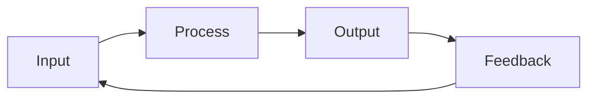
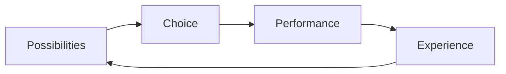

---
{"dg-publish":true,"permalink":"/cards/depth-psychology-theory/wheel-of-perception/","noteIcon":"1","created":"2023-04-07T16:08:07.284+02:00","updated":"2023-06-22T21:01:13.816+02:00"}
---



{ #bf4fe6}


```mermaid

graph LR; 

A("Ne💧") --> B("Ni🔥") --> C("Se🌪️") --> D("Si⛰️") --> A("Ne💧")

```{ #bdab20}


[[CARDS/Depth Psychology Theory/Foundational/Ne\|Ne💧]] →  [[CARDS/Depth Psychology Theory/Foundational/Ni\|Ni🔥]]→  [[CARDS/Depth Psychology Theory/Foundational/Se\|Se🌪️]]→  [[CARDS/Depth Psychology Theory/Foundational/Si\|Si⛰️]] 

