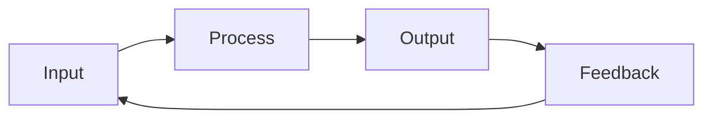
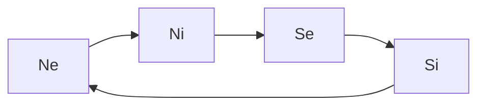

---
{"dg-publish":true,"permalink":"/cards/depth-psychology-theory/wheel-of-perception/","created":"2023-04-07T16:08:07.284+02:00","updated":"2023-05-02T20:43:10.603+02:00"}
---

[[CARDS/Depth Psychology Theory/Foundational/Ne\|Ne]] ➡️  [[CARDS/Depth Psychology Theory/Foundational/Ni\|Ni]]➡️  [[CARDS/Depth Psychology Theory/Foundational/Se\|Se]]➡️  [[CARDS/Depth Psychology Theory/Foundational/Si\|Si]] 