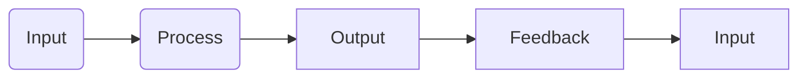
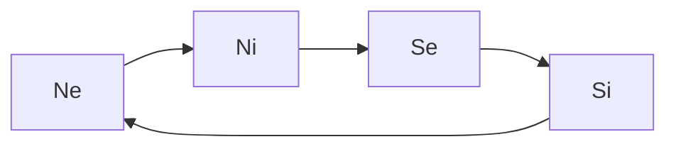
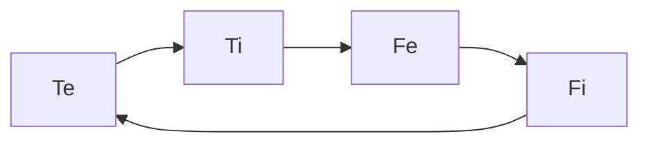

---
{"dg-publish":true,"permalink":"/cards/new-notes/cognitive-functions/","created":"2022-12-27T19:17:15.571+01:00","updated":"2023-04-03T23:06:56.070+02:00"}
---

Cognitive Functions are mental tools to be used and improved to deal with life and other humans. 
Like with our hands, some functions are prefered over others, such that we are more at ease with some functions than others. 

Example : some prefer to judge wether something is true or false, while others prefer to judge whether something is right or wrong. 
These preferences exclude each other : 
- [[ATLAS/Typology MOC/Ti 🗡️\|Ti 🗡️]] (*Deduce*) excludes [[ATLAS/Typology MOC/Fi 🔱\|Fi 🔱]] (*Weigh*) : to judge wether sth is true / false ([[ATLAS/Typology MOC/Ti 🗡️\|Ti 🗡️]]) one must retrain itself to judge whether it is good / bad ([[ATLAS/Typology MOC/Fi 🔱\|Fi 🔱]])
- [[ATLAS/Typology MOC/Si 🏔️\|Si 🏔️]] (*Sense*) excludes [[ATLAS/Typology MOC/Ni 🔥\|Ni 🔥]] (*Imagine*) 
- [[ATLAS/Typology MOC/Se 🌪️\|Se 🌪️]] (*React*) excludes [[ATLAS/Typology MOC/Ne 💦\|Ne 💦]] (*Predict*)
- [[ATLAS/Typology MOC/Te 🏹\|Te 🏹]] (*Believe*) excludes [[ATLAS/Typology MOC/Fe 💉\|Fe 💉]] (*Empathize*) 

## IPOF

[[Input\|Input]] : 
	[[ATLAS/Typology MOC/Ne 💦\|Ne 💦]] : possibilities
	[[ATLAS/Typology MOC/Te 🏹\|Te 🏹]] : beliefs 
[[Process\|Process]] : 
	[[ATLAS/Typology MOC/Ni 🔥\|Ni 🔥]] : desire
	[[ATLAS/Typology MOC/Ti 🗡️\|Ti 🗡️]] : deduction
[[Output\|Output]] : 
	[[ATLAS/Typology MOC/Se 🌪️\|Se 🌪️]] : performance
	[[ATLAS/Typology MOC/Fe 💉\|Fe 💉]] : ethics
[[Feedback\|Feedback]] : 
	[[ATLAS/Typology MOC/Si 🏔️\|Si 🏔️]] : needs
	[[ATLAS/Typology MOC/Fi 🔱\|Fi 🔱]] : morals

## Perception

[[ATLAS/Typology MOC/Ne 💦\|Ne 💦]] : [[ATLAS/Typology MOC/Ne 💦\|Extroverted Intuition]]
[[ATLAS/Typology MOC/Ni 🔥\|Ni 🔥]] : [[ATLAS/Typology MOC/Ni 🔥\|Introverted Intuition]]
[[ATLAS/Typology MOC/Se 🌪️\|Se 🌪️]] : [[ATLAS/Typology MOC/Se 🌪️\|Extroverted Sensation]]
[[ATLAS/Typology MOC/Si 🏔️\|Si 🏔️]] : [[ATLAS/Typology MOC/Si 🏔️\|Introverted Sensation]]

## Judgement

[[ATLAS/Typology MOC/Te 🏹\|Te 🏹]] : [[ATLAS/Typology MOC/Te 🏹\|Extroverted Thinking]] 
[[ATLAS/Typology MOC/Ti 🗡️\|Ti 🗡️]] : [[ATLAS/Typology MOC/Ti 🗡️\|Introverted Thinking]]
[[ATLAS/Typology MOC/Fe 💉\|Fe 💉]] : [[ATLAS/Typology MOC/Fe 💉\|Extroverted Feeling]]
[[ATLAS/Typology MOC/Fi 🔱\|Fi 🔱]] : [[ATLAS/Typology MOC/Fi 🔱\|Introverted Feeling]]

