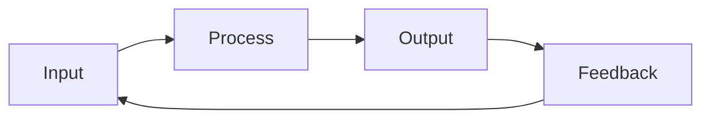
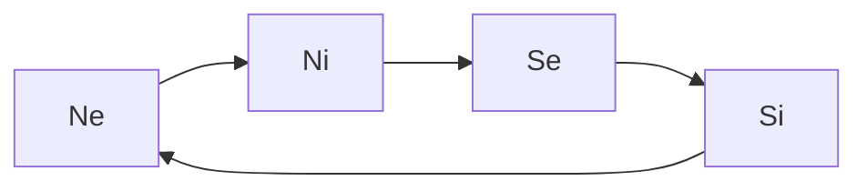
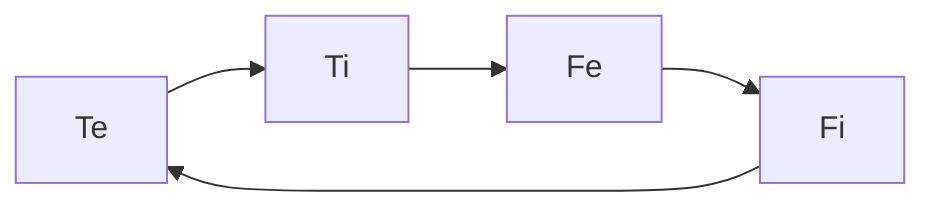

---
{"dg-publish":true,"permalink":"/cards/new-notes/cognitive-functions/"}
---

Humans have personal preferences for perceiving and judging the world, just like they have a preference for their right or left hand. Those preferences are called cognitive functions. The need for a hierarchy stems from the impossibility to perform these actions simultaneously although they are interdependant : 
- Estimate the veracity AND the value of something, although the value depends on the veracity and the pursuit of veracity depends on value.  
- Store AND desire, although the storage is composed of carried out desires and desires stem from seeing what has been. 
- See physical reactions AND long term consequences, although consequences result from combined physical reactions and physical reactions bring potential into reality. 
- Manipulate people's knowledge AND happiness, although knowledge enables increase in quality of life and quality of life enables learning. 

## IPOF

[[Input\|Input]] : 
	[[ATLAS/Typology MOC/Ne\|Ne]] : possibilities
	[[ATLAS/Typology MOC/Te\|Te]] : beliefs 
[[Process\|Process]] : 
	[[ATLAS/Typology MOC/Ni\|Ni]] : desire
	[[ATLAS/Typology MOC/Ti\|Ti]] : deduction
[[Output\|Output]] : 
	[[ATLAS/Typology MOC/Se\|Se]] : performance
	[[ATLAS/Typology MOC/Fe\|Fe]] : ethics
[[Feedback\|Feedback]] : 
	[[ATLAS/Typology MOC/Si\|Si]] : needs
	[[ATLAS/Typology MOC/Fi\|Fi]] : morals

## Perception

[[ATLAS/Typology MOC/Ne\|Ne]] : [[ATLAS/Typology MOC/Ne\|Extroverted Intuition]]
[[ATLAS/Typology MOC/Ni\|Ni]] : [[ATLAS/Typology MOC/Ni\|Introverted Intuition]]
[[ATLAS/Typology MOC/Se\|Se]] : [[ATLAS/Typology MOC/Se\|Extroverted Sensation]]
[[ATLAS/Typology MOC/Si\|Si]] : [[ATLAS/Typology MOC/Si\|Introverted Sensation]]

## Judgement

[[ATLAS/Typology MOC/Te\|Te]] : [[ATLAS/Typology MOC/Te\|Extroverted Thinking]] 
[[ATLAS/Typology MOC/Ti\|Ti]] : [[ATLAS/Typology MOC/Ti\|Introverted Thinking]]
[[ATLAS/Typology MOC/Fe\|Fe]] : [[ATLAS/Typology MOC/Fe\|Extroverted Feeling]]
[[ATLAS/Typology MOC/Fi\|Fi]] : [[ATLAS/Typology MOC/Fi\|Introverted Feeling]]

