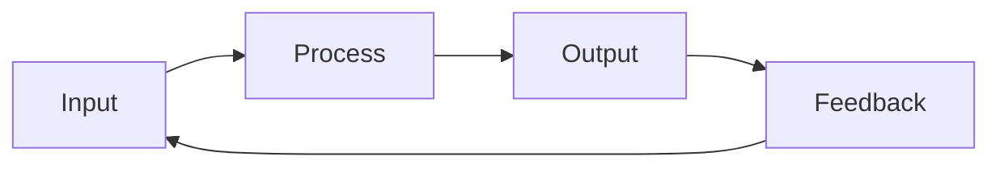
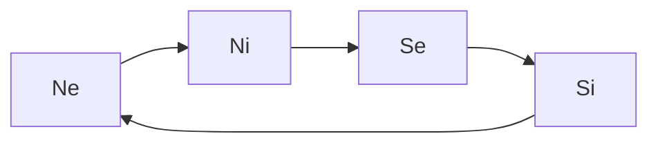
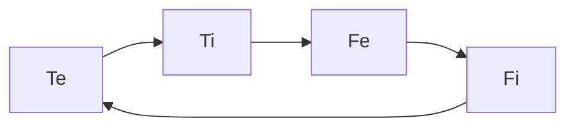

---
{"dg-publish":true,"permalink":"/cards/new-notes/cognitive-functions/"}
---

## IPOF

## Perception

[[ATLAS/Typology MOC/Ne\|Ne]] : [[ATLAS/Typology MOC/Ne\|Extroverted Intuition]]
[[ATLAS/Typology MOC/Ni\|Ni]] : [[ATLAS/Typology MOC/Ni\|Introverted Intuition]]
[[ATLAS/Typology MOC/Se\|Se]] : [[ATLAS/Typology MOC/Se\|Extroverted Sensation]]
[[ATLAS/Typology MOC/Si\|Si]] : [[ATLAS/Typology MOC/Si\|Introverted Sensation]]

## Judgement

[[ATLAS/Typology MOC/Te\|Te]] : [[ATLAS/Typology MOC/Te\|Extroverted Thinking]] 
[[ATLAS/Typology MOC/Ti\|Ti]] : [[ATLAS/Typology MOC/Ti\|Introverted Thinking]]
[[ATLAS/Typology MOC/Fe\|Fe]] : [[ATLAS/Typology MOC/Fe\|Extroverted Feeling]]
[[ATLAS/Typology MOC/Fi\|Fi]] : [[ATLAS/Typology MOC/Fi\|Introverted Feeling]]

