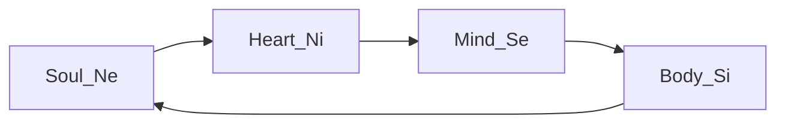
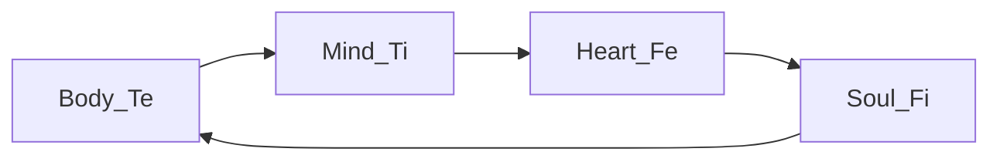

---
{"dg-publish":true,"permalink":"/temple/"}
---

[[ATLAS/Typology MOC/Soul Temple\|Soul Temple]] : [[ATLAS/Typology MOC/ENFP\|ENFP]] | [[ATLAS/Typology MOC/INFJ\|INFJ]] | [[ATLAS/Typology MOC/ESTP\|ESTP]] | [[ATLAS/Typology MOC/ISTJ\|ISTJ]]
[[ATLAS/Typology MOC/Heart Temple\|Heart Temple]] : [[ATLAS/Typology MOC/ENTP\|ENTP]] | [[ATLAS/Typology MOC/INTJ\|INTJ]] | [[ATLAS/Typology MOC/ESFP\|ESFP]] | [[ATLAS/Typology MOC/ISFJ\|ISFJ]]
[[ATLAS/Typology MOC/Mind Temple\|Mind Temple]] : [[ATLAS/Typology MOC/INFP\|INFP]] | [[ATLAS/Typology MOC/ENFJ\|ENFJ]] | [[ATLAS/Typology MOC/ISTP\|ISTP]] | [[ATLAS/Typology MOC/ESTJ\|ESTJ]]
[[ATLAS/Typology MOC/Body Temple\|Body Temple]] : [[ATLAS/Typology MOC/INTP\|INTP]] | [[ATLAS/Typology MOC/ENTJ\|ENTJ]] | [[ATLAS/Typology MOC/ISFP\|ISFP]] | [[ESFJ\|ESFJ]]

## Wheel of Perception 

## Wheel of Judgement

## IPOF
> Functions operate in an input-process-output-feedback order : 
> Ne input --> Ni process --> Se output --> Si feedback
> Te input --> Ti process --> Fe output --> Fi feedback